# NXTTRACK Canon

Last updated: 2026-06-23

Status: definitive planning draft. Product implementation starts only after product owner approval.

## 0. Sources And Scope

Sources analyzed or inspected:

- `NXTTRACK - Lovable Prompt.pdf`
- `NXTTRACK - Canon.pdf`
- `NXTTRACK - Infra.pdf`
- `nxttrack/platform`
- `nxttrack/swim-school-pro`
- Earlier `nxtdev` material as reference only

Product owner decisions now locked:

- Final rebuild happens in `nxttrack/platform`.
- `nxtdev` is reference only.
- Lovable UI source of truth is `nxttrack/swim-school-pro`.
- First target is staging, not a commercial launch tenant.
- Email provider is SendGrid, using SMTP first.
- Payments are manual first, with architecture ready for Mollie/iDEAL.

Lovable access status:

- GitHub connector access confirmed.
- Route tree, shells, shared UI components, design tokens, and mock data were inspected.
- Local clone is blocked by local Git credentials, but repo API access works.

## 1. Product Vision

NXTTRACK is a swim-first SaaS platform for lesson-based organizations. It supports the complete journey from public program discovery to intake, waitlist, placement, lessons, progress, badges, afzwem moments, certificates, payments, messages, reports, and daily operations.

NXTTRACK must feel purpose-built for swimming schools at the visible product layer. Internally it must remain generic enough to support football schools, sports clubs, martial arts schools, dance schools, and other training organizations later.

The product promise:

- Parents know what happens next.
- Children see progress in a positive way.
- Instructors work quickly during or around lessons.
- Admins manage capacity, placement, communication, and billing with less manual work.
- Platform owners can scale tenants, sectors, domains, and templates without a rebuild.

## 2. Target Market

First target market:

- Dutch swimming schools.
- Organizations with staged learning, recurring groups, scarce pool/lane capacity, waitlists, instructors, parent communication, payments, and diploma moments.

Later target markets:

- Football schools.
- Sports clubs.
- Martial arts schools.
- Dance schools.
- Lesson, training, and academy-style organizations.

## 3. Swim-First Positioning

Visible swim-school language is expected in the first product:

- Zwemschool.
- Ouder/verzorger.
- Leerling/kind.
- Zweminstructeur.
- Zwemles.
- Badje.
- Zwemdiploma.
- Afzwemmen.
- Bad, baan, locatie.

This language is part of the commercial focus. It belongs in tenant labels, seed templates, demo copy, marketing pages, and swim-sector terminology.

It must not become the core data model.

## 4. Future Sector Flexibility

Internal concepts stay generic:

- Tenant.
- Program.
- Stage.
- Group.
- Session.
- Resource.
- Participant.
- Guardian.
- Instructor.
- Enrollment.
- Group membership.
- Subscription.
- Payment plan.
- Progress item.
- Badge.
- Milestone event.
- Certificate.

Sector meaning comes from:

- Tenant terminology.
- Sector templates.
- Program/stage/progress templates.
- Branding and copy.
- Optional future sector modules.

Rule: never create core tables or services with swim-only names unless they are explicitly demo seed data or sector-template metadata.

## 5. Core Product Philosophy

NXTTRACK is built around six principles:

1. Swim-first experience, generic architecture.
2. Lovable UI is the visual source of truth.
3. Tenant isolation and role permissions are foundational, not polish.
4. Positive progress language beats punitive tracking.
5. Operational reality matters: capacity, staff, resources, billing, and communication must work together.
6. Staging readiness comes before any launch target.

The app should feel polished and premium, not like a generic admin template. The Lovable visual language includes soft aquatic backgrounds, blue/aqua accents, rounded cards, clear shells, responsive layouts, motion, charts, progress components, and role-specific dashboards.

## 6. User Roles

Core roles:

- Platform admin: manages NXTTRACK itself, tenants, sector templates, domains, global settings, support, and audit.
- Tenant owner/admin: manages one tenant's programs, planning, staff, participants, intake, waitlist, payments, communication, documents, and reports.
- Tenant staff/admin assistant: helps with tenant operations through configurable permissions.
- Instructor/trainer: sees assigned sessions/groups and records attendance, progress, notes, and badges.
- Guardian/parent: manages children, lessons, messages, documents, payments, progress, and diplomas.
- Participant/athlete/child: the learner, usually visible through parent shell first.
- Anonymous visitor: browses public tenant pages and can submit intake.

A user can belong to multiple tenants and hold different roles per tenant.

## 7. Platform Layers

NXTTRACK has these platform layers:

1. NXTTRACK marketing: public `nxttrack.nl` style site.
2. Platform admin: global admin surface for the NXTTRACK operator.
3. Tenant public website: tenant-branded public site.
4. Parent/athlete portal: family/participant logged-in shell.
5. Instructor/trainer portal: lesson and assessment shell.
6. Tenant admin backoffice: operational tenant shell.

Lovable confirms these route groups through:

- Public tenant routes: `/`, `/programmas`, `/intake`, `/nieuws`, `/agenda`, `/login`.
- Parent routes: `/parent/*`.
- Instructor routes: `/instructor/*`.
- Admin routes: `/admin/*`.
- NXTTRACK marketing routes: `/nxttrack/*`.

## 8. Public UserShell

The public UserShell is the logged-out tenant website. It includes:

- Sticky header.
- Tenant logo and branding.
- Desktop nav and mobile menu.
- Home, news, agenda, programs, intake, login.
- CTAs for trial, registration, and login.
- Footer with programs, demo links, and contact.

Lovable route group:

```txt
/
/agenda
/intake
/login
/nieuws
/programmas
```

Production meaning:

- Tenant public homepage.
- Program marketplace.
- Dynamic intake entry.
- News/events.
- Tenant login.

## 9. Parent / Athlete UserShell

The parent/athlete shell gives families one clear place for:

- Dashboard.
- Child selector.
- Current program/stage/group.
- Next lesson.
- Mijn lessen.
- Lesson details and cancellation.
- Catch-up lessons.
- Progress.
- Badges.
- Afzwem status.
- Diploma vault.
- Messages.
- Documents.
- Profile.
- Payments.

Lovable route group:

```txt
/parent
/parent/lessen
/parent/voortgang
/parent/diplomas
/parent/badges
/parent/afzwemmen
/parent/berichten
/parent/documenten
/parent/profiel
```

The shell must be calm, supportive, mobile-friendly, and positive.

## 10. Child Portal

The child portal is a future child-friendly layer. MVP can expose child-facing achievements inside the parent shell.

Later child portal scope:

- Current stage card.
- Badge wall.
- Friendly progress view.
- Next lesson.
- Digital diploma view.
- No billing.
- No private notes.
- No tenant admin data.

## 11. Instructor / Trainer UserShell

The instructor shell is tablet-first and lesson-focused.

Lovable route group:

```txt
/instructor
/instructor/agenda
/instructor/groepen
/instructor/leerlingen
/instructor/berichten
/instructor/taken
/instructor/documenten
/instructor/group/$id
/instructor/student/$id
```

Core instructor workflow:

```txt
Agenda -> Group/session -> Student -> Attendance/progress/notes/badge
```

Instructor capabilities:

- See today's assigned sessions.
- Open a group/session roster.
- Record attendance.
- Open a student dossier.
- Score progress items.
- Add internal notes.
- Add parent-visible notes.
- Award badges.
- Read messages, tasks, and documents.

## 12. Tenant AdminShell

Tenant AdminShell is the daily operations center.

Lovable route group:

```txt
/admin
/admin/agenda
/admin/leerlingen
/admin/afzwemmen
/admin/rapportages
/admin/berichten
/admin/taken
/admin/groepen
/admin/documenten
/admin/programma
/admin/intake
/admin/wachtlijst
/admin/instellingen
```

Tenant admin capabilities:

- Dashboard and KPIs.
- Planning board.
- Programs and stages.
- Groups and sessions.
- Resources and capacity.
- Participants and guardians.
- Instructors/staff.
- Intake submissions.
- Waitlist.
- Placement assistant.
- Slot offers.
- Afzwem module.
- Payments and subscriptions.
- Reports.
- Messages.
- Tasks.
- Documents.
- Settings.

## 13. Platform AdminShell

Platform AdminShell is separate from tenant admin. It can reuse shell visuals, but not route guards, data access, or tenant assumptions.

Platform admin capabilities:

- Tenant management.
- Sector templates.
- Domains and custom domains.
- Global themes.
- Platform settings.
- Support and audit.
- Release notes.
- Operational monitoring.

Risk to avoid: platform admin must never become a tenant admin route with a broader data query.

## 14. Core Workflow From Intake To Diploma

Canonical swim-school journey:

```mermaid
flowchart TD
  A[Parent visits tenant website] --> B[Selects program such as Zwemdiploma A]
  B --> C[Fills dynamic intake]
  C --> D[Chooses registration, trial, or waitlist option]
  D --> E[Chooses preferred days and times]
  E --> F[System recommends stage]
  F --> G[System checks groups, resources, and capacity]
  G --> H[Placement suggestion is created]
  H --> I[Admin approves or sends slot offer]
  I --> J[Parent accepts or declines]
  J --> K[Payment or subscription is linked when needed]
  K --> L[Child is placed in group]
  L --> M[Sessions appear in Mijn lessen]
  M --> N[Instructor sees child in group]
  N --> O[Attendance and progress are tracked]
  O --> P[Badge or compliment can be awarded]
  P --> Q[Parent receives notification]
  Q --> R[Child moves to next stage]
  R --> S[Old spot becomes available]
  S --> T[Waitlist matching is triggered]
  T --> U[Child becomes afzwem-ready]
  U --> V[Afzwem moment is planned]
  V --> W[Parent receives afzwem notification]
  W --> X[Result is registered]
  X --> Y[Digital diploma is generated]
  Y --> Z[Parent can download or share diploma]
```



## 15. Programs, Stages, Groups, Sessions And Resources

Core definitions:

- Program = the offered product or learning track.
- Stage = the learner's current level inside a program.
- Group = the recurring class at a fixed time/resource.
- Session = one concrete lesson date/time.
- Resource = pool, lane, field, room, court, or location.
- Instructor = person teaching the group/session.
- Enrollment = participant follows a program.
- Group membership = participant is placed in a group.
- Subscription/payment plan = billing contract or plan.
- Progress = development within a module/stage.
- Badge = achievement or milestone.
- Certificate/diploma = official result.

Critical rule:

Subscription/payment must not be confused with stage/level. A child moving from Badje 1 to Badje 2 usually keeps the same subscription. Only group/stage changes. Billing changes only when product, frequency, plan, or contract changes.

## 16. Subscription/Payment Logic

Billing models the commercial agreement, not the learning level.

MVP direction:

- Manual payments first.
- Track payment status in admin and parent views where needed.
- Link payment plans to programs when useful.
- Prepare clear integration boundary for Mollie/iDEAL.

Later direction:

- Mollie checkout.
- iDEAL.
- Webhooks.
- Payment event history.
- Failed payment handling.
- Subscription lifecycle.

Do not block progress/stage movement on payment unless tenant policy explicitly says so.

## 17. Smart Intake

Smart intake is the unified entry point for:

- Registration.
- Trial lesson.
- Waitlist request.
- Information request.

Smart intake should be:

- Tenant-aware.
- Program-aware.
- Sector-template aware.
- Dynamic, not hardcoded.
- Capable of storing full answers plus extracted structured fields.

Lovable currently maps both `Proefles` and `Inschrijven` into intake. Canonical decision: trial lesson is an intake option, not a separate duplicated core workflow.

## 18. Smart Waitlist

The waitlist must be operational, not just a static list.

It should filter and rank by:

- Program.
- Recommended/current stage.
- Preferred days/times.
- Location/resource.
- Age.
- Priority date.
- Capacity.
- Previous declined offers.

Admins need transparent suggestions. Blind auto-placement is not MVP.

## 19. Placement Assistant

The placement assistant recommends available groups or session slots.

Scoring dimensions:

- Capacity match.
- Time preference match.
- Resource/location match.
- Stage match.
- Age/group suitability.
- Instructor/resource constraints later.

The assistant explains why a suggestion is good. Admins approve placement or send slot offers.

## 20. Slot Offer Flow

Slot offers are generic.

Flow:

1. Admin or automation proposes a group/session slot.
2. Parent receives a tokenized offer link.
3. Parent accepts or declines.
4. Acceptance places the participant and may link subscription/payment.
5. Decline keeps or updates waitlist state.
6. Offer expires after configured time.
7. All transitions are audited.

Slot offers support both waitlist placement and direct intake placement.

## 21. Capacity And Planning

Capacity combines:

- Program defaults.
- Group capacity.
- Session capacity overrides.
- Resource capacity.
- Instructor availability.
- Minimum staff requirements.
- Optional trial/catch-up capacity.

Planning board needs:

- Day/week/month views.
- Resources and lanes/rooms.
- Occupancy colors.
- Conflicts.
- Instructor assignment.
- Drag-and-drop later, not before stable core data.

## 22. Catch-Up Lessons

Catch-up lessons are operational entitlements, not billing plans.

Flow:

- Parent cancels or tenant marks absence.
- Tenant policy decides whether a catch-up credit is created.
- Credit may expire.
- Parent can request/select available catch-up moments.
- Capacity check protects the target session.
- Admin approval may be required depending on policy.

## 23. Progress System

Progress is positive and stage-based.

Rules:

- Show one active module/stage at a time to parents.
- Keep instructor scoring fast.
- Use a 5-level positive scale.
- Keep internal notes separate from parent-visible notes.
- Tenant can choose display style later: stars, smileys, bars, or labels.

Example labels:

1. Startend
2. Aan het oefenen
3. Groeiend
4. Sterk
5. Klaar voor volgende stap

Avoid negative language like failed or bad.

## 24. Badges And Achievement Cards

Badges support motivation and recognition.

Types:

- Skill badge.
- Compliment badge.
- Stage completion badge.
- Milestone badge.
- Diploma badge.

Achievement cards may be shareable, but sharing requires parent control and privacy settings.

## 25. Afzwem Module

Afzwem is modeled generically as a milestone event.

Flow:

- Participant becomes ready based on progress.
- Admin schedules event.
- Parent receives notification.
- Parent sees instructions.
- Result is registered.
- Diploma/certificate is issued on success.

Use positive communication for children who need more practice.

## 26. Digital Diploma Vault

The diploma vault stores official certificates/diplomas.

Fields/capabilities:

- Certificate record.
- Awarded date.
- Program/milestone.
- Issuer.
- Tenant branding.
- PDF/image storage.
- Download/share controls.
- Verification link later.

Diplomas are private by default.

## 27. Payments

MVP:

- Manual payment records/status.
- Admin payment overview.
- Parent payment status where useful.
- Subscription/payment plan separate from stage.
- Mollie/iDEAL integration boundary prepared.

Later:

- Mollie/iDEAL checkout.
- Webhook verification.
- Automated payment events.
- Failed payment flows.
- Invoice exports.

## 28. Messages, Tasks And Documents

Communication and operations include:

- Parent messages.
- Staff/instructor messages.
- Group messages.
- Tasks assigned to staff.
- Documents and manuals.
- Parent-visible files.
- Internal-only files.

Permissions decide visibility. Private instructor notes and private admin documents must never leak to parents.

## 29. Reports

Reports should cover:

- Active participants.
- Intake volume.
- Waitlist length.
- Placement conversion.
- Occupancy.
- Instructor workload.
- Revenue and manual payment status.
- Progress distribution.
- Afzwem readiness/results.
- Churn/cancellations.
- Open invoices later.

MVP can start with dashboard summaries. Exports come later.

## 30. Privacy And Permissions

Non-negotiable rules:

- Every private tenant-scoped table is tenant-isolated.
- Parent sees only their own child/family data.
- Instructor sees assigned groups/sessions/participants unless tenant permissions expand this.
- Tenant admin sees only their tenant.
- Platform admin is separate and global.
- Public routes expose only approved public content.
- Private/admin routes are noindexed.
- Authorization is enforced server-side and database-side, not only in UI.
- Service role usage is tightly wrapped and explicitly filtered.

## 31. AI Strategy

AI is not MVP-critical.

Allowed later uses:

- Intake summaries.
- Placement rationale drafts.
- Parent-friendly message drafts.
- Report summaries.
- Support assistant.

Rules:

- AI assists, not decides.
- No hidden automated placement or billing decisions.
- Sensitive child data requires policy, logging, and controls.
- Tenant-level opt-in may be required.

## 32. What Is In MVP

MVP includes:

- Lovable-preserved visual system and shells.
- Multi-tenant routing foundation.
- Supabase Auth and tenant roles.
- Tenant terminology foundation.
- Public tenant website and program marketplace.
- Dynamic intake foundation.
- Programs, stages, groups, sessions, resources.
- Capacity basics.
- Waitlist and placement assistant foundation.
- Slot offer flow.
- Parent portal basics.
- Instructor portal basics.
- Tenant admin basics.
- Manual payment status.
- SendGrid SMTP email foundation.
- Secure staging deployment.

## 33. What Is Later

Later:

- Full child portal.
- Advanced AI.
- Full Mollie/iDEAL automation.
- Advanced reporting exports.
- Drag-and-drop planning depth.
- Advanced diploma template editor.
- Custom domain self-service.
- More sector templates.
- Push notifications.
- Production launch hardening after staging.

## 34. Design-To-Production Mapping

| Lovable screen/module | Production module | UI state | Backend/domain work |
| --- | --- | --- | --- |
| Public homepage | Public Tenant Website | Reference exists | Tenant branding/content/routing |
| Program overview | Program Marketplace | Route exists | Programs, prices, capacity, waitlist |
| Intake form | Dynamic Intake | Route exists | Intake schema/submissions/answers |
| Parent dashboard | Parent Portal Home | Strong reference | Family, child, enrollment, next lesson |
| Mijn lessen | Lessons/Catch-up | Route exists | Sessions, attendance, cancellation, credits |
| Progress page | Progress System | Route exists | Progress modules/items/scores |
| Badges page | Achievements | Route exists | Badge catalog and awards |
| Afzwem page | Milestone Event | Route exists | Readiness, event, invite, result |
| Diplomas page | Digital Diploma Vault | Route exists | Certificates, storage, download/share |
| Instructor dashboard | Instructor UserShell | Strong reference | Assigned sessions/tasks/messages |
| Instructor agenda | Group/session workflow | Route exists | Sessions and group memberships |
| Group detail | Attendance workflow | Strong reference | Session roster and attendance |
| Student assessment | Progress Assessment | Strong reference | Scoring, notes, badges |
| Admin dashboard | Tenant Ops Dashboard | Strong reference | KPIs, occupancy, alerts |
| Planboard | Planning Board | Route exists | Resources, sessions, instructors, conflicts |
| Students/payments | Participants + Billing | Route exists | Profiles, enrollments, subscriptions |
| Reports | Reporting | Route exists | Aggregations and exports |
| Messages/tasks/groups/documents | Admin Operations | Routes exist | Permissions, storage, notifications |
| NXTTRACK marketing | Platform Marketing | Strong reference | Final copy/CMS decision |
| Platform admin shell | Platform Admin | Pattern needed | Global tenants/domains/templates/support |

## 35. Conflicts / Decisions Needed

| Conflict | Source A says | Source B says | Risk | Recommended decision | Reason |
| --- | --- | --- | --- | --- | --- |
| Runtime | Lovable uses TanStack/Vite | Final deployment targets Next.js | Copying runtime would fight infra plan | Use Lovable for UI, Next.js for final app | Preserves design while matching platform architecture |
| Repo target | Historical `nxtdev` exists | Product owner says `nxttrack/platform` | Building in wrong repo | Build only in `nxttrack/platform` | Single source of truth |
| Swim labels | Lovable uses swim copy | Future sectors required | Swim-only core | Swim terminology in visible labels, generic internals | Supports future sectors |
| Trial flow | Public nav has Proefles and Inschrijven | Intake should be unified | Duplicate forms | Trial is intake option | One dynamic intake engine |
| Program vs plan | Swim levels look commercial | Billing is separate | Stage changes could trigger false billing | Program/stage/group are learning; subscription/payment plan is billing | Matches real swim-school operations |
| Admin shells | Tenant admin and platform admin can look similar | Access boundaries differ | Cross-tenant leaks | Share visual primitives, separate guards/data | Safety with consistent UI |
| MVP scope | Lovable has many screens | Secure foundation comes first | Big-bang build | Dependency-based roadmap | Reduces implementation risk |
| Launch target | Earlier planning implied launch tenant | Product owner says staging first | Wrong optimization | Make staging the first milestone | Clean foundation before sales launch |
