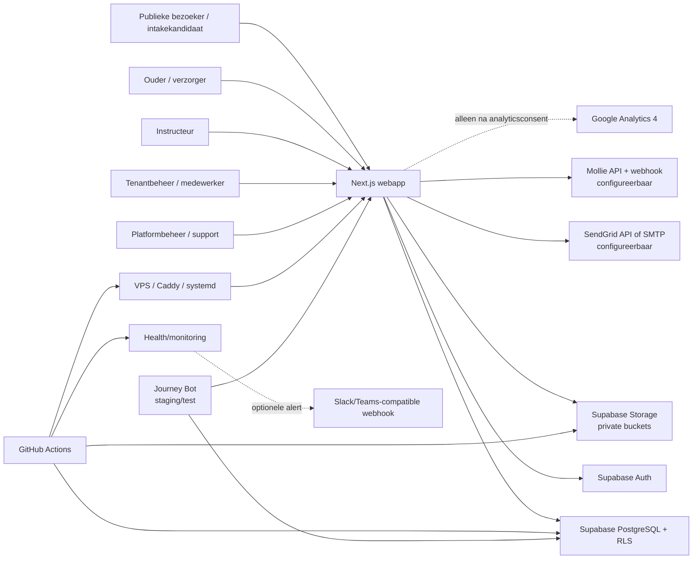

# 01 — Product- en omgevingskaart

## Technische hoofdstructuur

| Onderdeel | Feit | Status | Toepassing |
|---|---|---|---|
| Workspace | Eén private pnpm-workspace met rootpackage `@nxttrack/platform` en één apppackage `@nxttrack/web`. | `OBSERVED` `[E001]` | alle omgevingen |
| Webapp | Next.js 16 App Router, React 19, TypeScript en standalone Node-output. | `OBSERVED` `[E001]` | dev/staging/productie |
| Backend | Server components/actions en zeven API-routes gebruiken Supabase Database, Auth en Storage. | `OBSERVED` `[E003]` | configureerbaar per omgeving |
| Database | PostgreSQL-schema wordt beheerd door versioned SQL-migraties onder `supabase/migrations`. | `OBSERVED` `[E007]` | source-of-truth; apply-status per omgeving onbekend |
| Native apps | Geen iOS-, Android-, Expo- of app-storeproject aangetroffen. | `OBSERVED` `[E014]` | repository |
| Queues/Edge | Geen Supabase Edge Function of externe queueworker aangetroffen. Automatisering gebruikt webrequests, server actions en GitHub-schedules. | `OBSERVED` `[E014]` | repository |

## Portals en bereikbare interfaces

| Interface | Routes/gebruik | Status en bewijs |
|---|---|---|
| NXTTRACK-marketing | `/nxttrack`, dynamische commerciële subpagina’s en `/nxttrack/zwemscholen`; publiek, met optionele platform-GA4. | `OBSERVED` `[E002]` |
| Publieke tenantsite | `/`, `/agenda`, `/programmas`, `/nieuws`, `/intake`, `/plaatsing-aanbod`, login- en wachtwoordroutes; tenant via hostname. | `OBSERVED` `[E002]` |
| Ouder-/familieportaal | `/portaal` met kinderen, lessen, voortgang, badges, afzwemmen, diploma’s, berichten, documenten, betalingen en profiel. | `OBSERVED` `[E002]` |
| Instructeursomgeving | `/instructor` met agenda, groepen, leerlingdossiers, aanwezigheid/voortgang, berichten, documenten en taken. | `OBSERVED` `[E002]` |
| Tenant-backoffice | `/admin` met planning, programma’s, resources, groepen, leerlingen, intake, wachtlijst/plaatsing, afzwemmen, communicatie, documenten, betalingen, rapportage, automatisering, import, branding en instellingen. | `OBSERVED` `[E002]` |
| Platform-control-plane | `/platform` met tenantoverzicht, uitnodigingen, globale mailinstellingen, onboarding, offboarding en Journey Bot-testtools. | `OBSERVED` `[E002]` |
| Zelfstandige leerlingomgeving | Rol `athlete` bestaat in schema, maar geen afzonderlijk leerlingportal of routegroep is aangetroffen. | `INFERRED` `[E006]` |

## API-routes, jobs en webhooks

| Type | Integratiepunt | Gedrag | Status |
|---|---|---|---|
| Health | `GET /api/health` | Build-/commitmetadata en optionele databaseprobe. | `OBSERVED` `[E003]` |
| Private bestanden | `/api/files/certificate/[id]`, `/api/files/tenant-document/[id]` | Autorisatiecontrole en ophalen uit private Supabase-buckets. | `OBSERVED` `[E003]` |
| Offboardingexport | `/api/platform/offboarding/[id]/export` | Platformadmin exporteert tenanttabellen naar JSON; Storage-bytes zitten niet inline. | `OBSERVED` `[E003]` |
| Mollie | `/api/webhooks/mollie` | Inkomende providerstatus; lokale status- en financiële synchronisatie. | `OBSERVED` `[E003]` |
| Incasso | `/api/internal/billing/collections` | Geauthenticeerde interne batch voor terugkerende Mollie-incasso. | `OBSERVED` `[E004]` |
| Journey Bot | `/api/internal/journey-bot/tick` | Geauthenticeerde tick voor synthetische stagingreizen. | `OBSERVED` `[E012]` |
| Schedules | GitHub Actions | Operationele monitor, billing-collection en Journey Bot-ticks zijn schedules; overige workflows zijn deploy/audit/rehearsal/backup. | `OBSERVED` `[E004]` |
| Push | Geen pushendpoint, Push API-aanroep of pushsubscriptiontabel gevonden. | Geen actieve pushnotificaties aangetroffen. | `OBSERVED` `[E014]` |

## Tenantisolatie

1. Hostresolver classificeert marketing-, platformadmin- en tenanthosts en zet intern
   `x-nxttrack-*`-headers; tenant-slug komt uit een gevalideerde hostresolutie. `[E005]`
2. De identity boundary kent `tenants`, `tenant_domains`, `tenant_memberships` en
   `platform_memberships`. Domeintabellen gebruiken unieke hostnames en per tenant maximaal één
   primaire hostname. `[E005]`
3. Vrijwel alle domeintabellen dragen `tenant_id` en samengestelde foreign keys beperken
   cross-tenantrelaties. RLS-functies toetsen actieve platform- en tenantrollen. `[E008]`
4. De applicatie gebruikt bij bevoorrechte servermutaties een server-only Supabase secret client met
   `persistSession: false`; zulke calls omzeilen RLS en moeten daarom telkens zelf tenantfilters en
   actorchecks toepassen. `[E021]`
5. `platform_support` komt in meerdere RLS-viewpolicies voor en kan technisch veel tenantdata bekijken.
   Er is geen impersonatiefunctie gevonden, maar ook geen aparte just-in-time supportgoedkeuring in
   code. `[E022]`

Dat punt 4 en 5 zijn geen bewijs van een incident; ze zijn wel relevante least-privilege- en
procesvragen.

## Rollen

| Niveau | Rollen | Technisch bereik |
|---|---|---|
| Platform | `platform_owner`, `platform_admin`, `platform_support` | Control-plane; platformrollen worden uit DB-lidmaatschappen geladen. Support krijgt via diverse RLS-policies leestoegang. |
| Tenant | `tenant_owner`, `tenant_admin`, `tenant_staff`, `instructor`, `parent`, `athlete` | Backoffice, instructeur, ouder en mogelijk leerling; status is `invited`, `active` of `suspended`. |
| Systeem | Supabase `service_role`/secret key; cron- en billing secrets | Alleen server/workflow; geen menselijke UI-rol. |
| Test | Journey Botrecords met `is_test`, `journey_run_id` en staging-guards | Synthetische data; geen zelfstandig Auth-account vereist voor ieder gesimuleerd kind. |

Bron: `OBSERVED` `[E006]`, `[E012]`, `[E021]`.

Een aparte rol voor planner, financieel medewerker of alleen-lezengebruiker is niet aangetroffen.
Tenantadmin- en tenantownerchecks dekken veel operationele acties gezamenlijk. `[E006]`

## White-label en PWA

- Tenantbranding bewaart productnaam, logo-URL, primaire/accentkleur, e-mailnaam/-footer,
  portalwelkomsttekst, `custom_css`, PWA-toggle en status. UI schrijft een deel hiervan; actief gebruik
  van `custom_css` is niet gevonden. `OBSERVED/INFERRED` `[E009]`
- Tenantdomeinen ondersteunen subdomein en custom domain met pending/verified/disabled status.
  Provisioning markeert alleen een `*.nxttrack.nl`-hoofddomein direct verified; een custom domain wordt
  pending aangemaakt. `OBSERVED` `[E005]`
- Een webmanifest en serviceworker zijn aanwezig. Registratie gebeurt alleen bij
  `NODE_ENV=production`; de serviceworker cachet alleen dezelfde-origin buildassets en het logo, geen
  navigaties, API-antwoorden of geautoriseerde requests. `OBSERVED` `[E010]`
- Er is geen tenant-specifiek manifest of native distributie aangetroffen; `pwa_enabled` is daarom een
  productinstelling met beperkte aantoonbare runtimewerking. `INFERRED` `[E009]`

## Omgevingen en feature flags

| Omgeving | Repositoryfeit | Onzekerheid |
|---|---|---|
| Development | `.env.example` start met `APP_ENV=development`; lokale Next-poort 3000. | Lokale data/configuratie onbekend. |
| Staging | Eigen deploy, tests, demo-seed, Journey Bot, Mollie-sandbox en backup/restore-rehearsals. Stagingguards controleren host en testcredentials. | Actuele database-inhoud en toegepaste SHA niet onderzocht. |
| Productie | Eigen GitHub Environment, standalone service/Caddy-runbooks, strikte health/migratie-/bootstrapdefaults en productie-artifactretentie. | Actuele live SHA, providerinstellingen en ingeschakelde functies zijn zonder externe inspectie `UNKNOWN`. |

Belangrijke schakelaars/configuratie:

- `RUN_DB_MIGRATIONS`, `DB_MIGRATE_DRY_RUN`, `BOOTSTRAP_PLATFORM_OWNER`,
  `BOOTSTRAP_PLATFORM_OWNER_RESET_PASSWORD`;
- `NEXT_PUBLIC_GOOGLE_ANALYTICS_ID`; tenant-GA4 daarnaast via `tenant_settings.analytics_enabled`;
- `ALLOW_JOURNEY_BOT_IN_PRODUCTION` (standaard false), `ALLOW_JOURNEY_BOT_SEED`,
  `CRON_SECRET`;
- tenant billingconfig: providerstatus, mode, `recurring_enabled`,
  `automatic_collection_enabled`, `automatic_retries_enabled`;
- `MONITORING_ENABLED`, `MONITOR_ALERTS_ENABLED`, `ALERT_WEBHOOK_URL`;
- tenantbranding `pwa_enabled`.

Bron: `OBSERVED` `[E011]`, `[E012]`, `[E023]`.

## Actief, test, gepland en onbekend

| Classificatie | Onderdelen |
|---|---|
| Actieve productcode | Portals, intake, planning, aanwezigheid, voortgang, plaatsing, communicatie, documenten, diploma’s, handmatige billing, tenant lifecycle, import en configureerbare Mollie/GA4/SendGrid-integraties. |
| Staging/test | Journey Bot, demo-seed, E2E-fixtures, Mollie testrehearsals, storage restore rehearsal, screenshots en releasebewijs. |
| Bereikbaar maar onvolledig | Automation rule CRUD heeft geen aangetroffen algemene eventrunner; `media_consents` heeft schema/RLS/export maar geen aangetroffen gebruikersflow; PWA-toggle stuurt geen tenant-specifieke serviceworker; rol `athlete` heeft geen eigen portal. |
| Niet aangetroffen | Generatieve AI, externe AI-API, pushnotificaties, native app, biometrie, geolocatie, video-/foto-uploadflow, supportticketsysteem, captcha, realtime queue of impersonatie. |
| Runtime onbekend | Exact ingeschakelde productieproviders, tenantconfiguraties, toegepaste migraties, datavolumes en live SHA. |

## Systeemdiagram

Hostingprovider, fysieke VPS-locatie en contractuele leveranciersketen zijn niet uit code vastgesteld.
`UNKNOWN` `[E013]`

