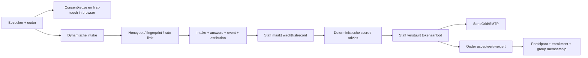
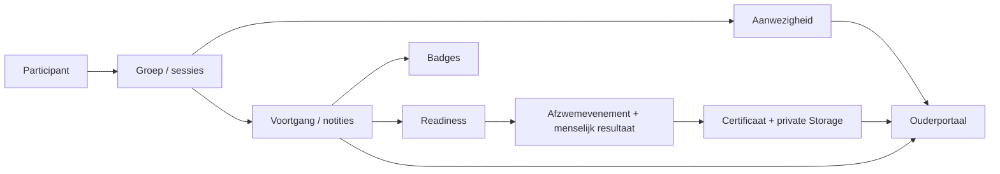
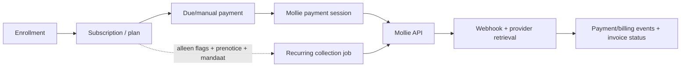

# 03 — Verwerkingen en gegevensstromen

Voor iedere verwerking is de rechtsgrond `OWNER DECISION REQUIRED`. De kolom “termijn” vermeldt alleen
wat code of repositorydocumentatie daadwerkelijk afdwingt.

## Verwerkingsregister

| Proces en doel uit functionaliteit | Betrokkenen; bron | Persoonsgegevens | Ontvangers/toegang | Systemen/leveranciers; opslag/doorgifte | Automatisering | Termijn; delete/export | Beveiliging; bewijs | Ontbrekende keuze |
|---|---|---|---|---|---|---|---|---|
| Zakelijke demo/contact: kennismaking | Potentiële klant; eigen mailclient | Vrijwillige e-mailinhoud, mogelijk leerling-/medewerkeraantallen | NXTTRACK-mailbox | `mailto:hello@nxttrack.nl`; mailboxprovider onbekend | Alleen openen mailclient | Geen apprecord; mailboxtermijn onbekend | Geen webform of gesimuleerde ontvangst. `OBSERVED` `[E063]` | Mailboxprovider, doel, termijn, responsclaim |
| Tenantonboarding: zwemschool inrichten | Eigenaar/staff; platformadminformulier | Organisatienaam, ownernaam/-mail, staffmails, domeinen, branding, prijsplaninput | Platform owner/admin; uitgenodigden | Supabase + SendGrid/SMTP | Maakt tenant/config/programmas/resources/groep/betaalplan en invites | Geen foutrollback; offboardingexport later | Platformguard, server secret. `[E065]` | Autorisatieproces, incomplete-run cleanup |
| Accountuitnodiging: toegang verlenen | Medewerker/ouder; admin | Naam/e-mail/rol, inviter/invitee-ID, tijdelijk wachtwoord | Ontvanger, bevoegde admin | Supabase Auth/DB; SendGrid/SMTP | Authuser email-confirmed + membership direct active; mail | Invitation expiry 14 d, geen gevonden cleanup/enforcement | Actorcheck, sterk gegenereerd wachtwoord. `[E045]`, `[E048]` | Tempwachtwoordmail, acceptance/expiry, accounttermijn |
| Login/sessie/reset: authenticeren | Accountgebruiker | Authcookie/token, user-ID/e-mail, rollen; resetcodehash/attempts | Supabase Auth; app | Browsercookie + Supabase | SSR refresht cookie; resetcontrole | Reset 15 min; sessie/cookie/providertermijn onbekend | Server `getUser`, password policy/rate-limit. `[E045]`, `[E049]` | MFA, logout/revoke, cookie-instellingen |
| Publieke intake: contact/planning | Kind + 1/2 verzorgers; wizard | Contact, kindnaam/DOB, ervaring, voorkeuren, vrij bericht, consent, bron | Tenantowner/admin/staff; platform via service access mogelijk | Supabase DB; geen mail op submit | Bottrap, rate-limit, dedupe, top-3 advies | Alleen rate counters >2 d; intake geen termijn/delete/export voor subject | Validatie, tenantlookup, HMAC-fingerprint. `[E026]`, `[E027]` | Grondslag, consentversie, termijn, withdrawal, vrije velden |
| Leadattributie/GA4: acquisitie meten | Publieke bezoeker/kandidaat; URL/referrer/browser | UTM/referrer/path/channel; GA page/path/title; consent | Tenantrapport, NXTTRACK; Google na grant | Browser, Supabase; Google Analytics na consent | Kanaalclassificatie/page_view/generate_lead | Browserstores zonder vaste expiry; DB geen termijn; Google unknown | Sanitization, geen click-ID-waarde, GA signals off. `[E028]`, `[E052]` | First-party grondslag, GA-contract/retentie, consentbewijs |
| Intake→wachtlijst: kandidaat opvolgen | Kind/verzorger; intake + staff | Contact/DOB/ervaring/voorkeuren/adminnotitie | Tenantstaff | Supabase DB | Staff start conversie; stagevoorstel | Geen aflooptermijn; tenantexport/delete | Tenantfilters/audit. `[E029]` | Sluiten/opschonen afgewezen kandidaten |
| Slim intakeadvies/plaatsingsscore: passende opties tonen | Kind/verzorger/staff; opgegeven ervaring, voorkeur, groep/capaciteit | Ervaring, dagen/delen, niveau, capaciteit, redenen | Ouder krijgt 3 kwalitatieve opties; staff volledige scores | Lokale deterministische code + Supabase | Advies; staff kiest live plaatsing | Snapshot/audit zonder termijn | Geen externe AI; uitlegbare redenen. `[E029]`, `[E066]` | Leeftijd wordt niet benut; fair/override-review |
| Plaatsingsaanbod: plek aanbieden | Kind/verzorger; staff | Ouder-e-mail, aanbodgroep, token, status | E-mailontvanger; tenantstaff | Supabase; SendGrid/SMTP; token in URL | Staff maakt/verstuurt; ouder accepteert/weigert | Aanbod 7 d; geen purge | Alleen tokenhash DB, capacity hercheck. `[E067]` | Bearer-token in browser/adminquery, identiteit ontvanger |
| Inschrijving/groep/planning: lessen organiseren | Kind/instructeur/staff; intake/import/manual | Identiteit, programma/niveau/groep, rooster, resource, assignments | Staff, toegewezen instructor, gekoppelde guardians | Supabase | Aanbodacceptatie kan participant/enrollment/membership maken | Geen categoriebrede termijn; cascade bij tenantdelete | RLS/FKs/tenantfilters. `[E030]` | Einde-inschrijving, archief- en verwijdertermijn |
| Lesannulering/inhaalcredit | Kind/verzorger; ouderactie/tenantpolicy | Reden, sessie, policy outcome, credit/verval | Ouder, staff | Supabase | Cutoff en creditberekening | Credit expiry configureerbaar 1–365 d; recordtermijn onbekend | Guardian/tenant RLS. `[E064]` | Redentekst, historie-/verwijdertermijn |
| Aanwezigheid: lesdeelname registreren | Kind/instructor; instructor | Status, tijd, note, marker | Toegewezen instructor, tenantstaff, mogelijk parent via dossiers | Supabase | Batch/manual markering | Geen termijn | Assignment- en participantcheck/RLS. `[E031]` | Zichtbaarheid note, correctie, bewaartermijn |
| Voortgang/notities/badges: ontwikkeling volgen | Kind/instructor/verzorger | Scores, labels, notes, skills, badge, visibility | Staff/instructor; ouder waar parent_visible | Supabase | Instructeur voert in; notificatie kan volgen | Archive-status, geen purge/termijn | RLS scoped op guardian/assignment. `[E031]` | Subjectieve notes, inzage/correctie, termijn |
| Diplomering/certificaten: afzwemmen beheren | Kind/verzorger/staff | Readiness/checklist/score, event/result, certificaat en bestand | Staff/instructor/guardian | Supabase DB/Storage; e-mailprovider bij notificatie | Certificaat volgt na menselijk geregistreerd passed | Status/revoke, geen algemene termijn | Menselijke besluitstap; private Storage. `[E032]` | Diploma-/evidencetermijn, correctie/intrekking |
| Berichten/notificaties/e-mail: informeren | Gebruikers; tenant/adminsystemen | Ontvanger/e-mail, subject, inhoud/status/error/metadata | Doelgroep; SendGrid of SMTP-provider | Supabase + provider | Transactionele verzending/statuslogging | Geen DB-termijn; providertermijn unknown | Audience/visibility RLS; mailsecrets encrypted. `[E033]` | Voorkeuren, unsubscribe, marketing vs transactioneel |
| Documenten delen: tenantcontent | Uploader/ouders/instructors; upload | Bestandsinhoud + metadata; kan vrije PII bevatten | Per audience/visibility en rollen | Private Supabase Storage; signed URL 5 min | Geen inhoudsanalyse | Archive-status; tenantdelete alleen gerefereerde paden | 20 MB/MIME allowlist/RLS. `[E034]` | Malware/SVG-scan, categorie/termijn, orphan objects |
| Handmatige billing: lesgelden beheren | Kind/verzorger/staff | Plan, abonnement, bedrag, due/paid, reference/method/notes | Ouder, staff, platformsupport via bepaalde policies | Supabase | Statussen/factuurvorming | Geen financiële termijn | Tenant/guardian RLS. `[E035]` | Wettelijke/operationele termijn, betaalrol |
| Mollie checkout/incasso/refund: betaling uitvoeren | Guardian/kindrelatie; tenantconfig/parent/admin | Naam/e-mail, bedrag, provider-ID’s, metadata, last4, mandaat/consent, failures | Mollie; tenantstaff; guardian | Directe Mollie API/webhook + Supabase | Idempotente payments, optionele recurring/retries, sync | Geen lokale/providertermijn of cross-provider delete | Keymodus, webhook provider-retrieval, two flags. `[E036]` | Live activatie, Mollie contract/regio, prenotice/mandaatbeleid |
| CSV-import: migreren/onboarden | Geïmporteerde personen + admin | Raw/normalized rows, namen/e-mail/DOB/referenties/betalingen, mapping/errors | Tenantowner/admin; SendGrid bij guardianinvite | Supabase; e-mailprovider | Validate, dedupe, dry-run, create-only apply/rollback | Raw rows/job blijven; rollback is niet volledige accountdelete | 2 MB/5000 rows, signed manifest. `[E037]`, `[E068]` | Bronsanering, termijn, incomplete rollback |
| Rapportage: operatie/lead/billing volgen | Tenantstaff; producttabellen | Aggregaten; leadrapport bevat bronnen/consentrate, onderliggende records blijven PII | Tenantmanagement | Supabase; Recharts in app | Lokale aggregatie; testrecords uitgesloten in leadrapport | Snapshottermijn onbekend | Tenantfilters, tabelfallback. `[E043]` | Export/retentie en small-number disclosure |
| Automation builder: regels configureren | Tenantadmin; regels | Event/action, message/config, creator | Tenantadmin | Supabase | Geen algemene executor aangetroffen | Archive-status; geen termijn | RLS/FORCE. `CONFLICT` tussen configuratie-UI/schema en ontbrekende executor `[E040]` | UI mag uitvoering niet impliceren; doeleinden/actions |
| Journey Bot: kwaliteit simuleren | Synthetische kinderen/guardians; platformtesttool | Realistische testidentiteit en volledige journey | Platformtestteam; Supabase | App/Auth/DB; staging workflows | Volautomatische synthetische journey; mail/payments onderdrukt | cleanup setting, maar handmatige soft archive en Authrestanten | `.test`, `is_test`, budgets/locks. `[E041]`, `[E069]` | Productieoverride uitzetten/bevestigen; hard cleanup |
| Tenantexport/offboarding: contracteinde | Alle tenantbetrokkenen; platformadmin | Volledige rijen, providerpayloads, Storagepaden, manifest; tombstone tenantnaam | Platformowner/admin; downloadontvanger | Supabase; browserdownload; Storage apart | Export/status; owner-approved delete na 30–365 d | Tenant cascade + gerefereerde Storage; Auth/externe providers/backups incompleet | Dubbele bevestiging, actorlog, checksum. `[E038]`, `[E070]` | Fail-closed export, encryption, complete inventory, Auth/provider deletion |
| Objectback-up/herstel: continuïteit | Alle personen in documenten/diploma’s | Volledige versleutelde bestanden, paden/checksums | GitHub artifacttoegang; hersteloperator | Supabase Storage → GPG → GitHub Actions artifact | Alleen handmatige workflow | GitHub artifact 30 d; lange immutable route gepland | Encrypt-before-upload, checksum/no-overwrite. `[E058]` | Schedule/RPO/RTO, regio/DPA, erasure after restore |
| Monitoring/incident: beschikbaarheid bewaken | Operators; indirect gebruikers | Aggregaten, environment, owners, SHA/run URL; geen mailbody/recipient in alert | Configureerbare Slack/Teams/Discord/generic endpoint | GitHub Actions + webhook | Elke 15 min indien enabled | Logretentievariabele wordt niet technisch toegepast | URL-redaction, read-only DBcounts. `[E057]`, `[E071]` | Runtime enablement, security events, incident/datalekregister |
| DSAR/klacht/datalek: verzoek of incident afhandelen | Betrokkene/operator | Niet gespecificeerd | Niet gespecificeerd | Geen gerichte workflow gevonden | Geen | Geen | Runbooks voor operations, geen subjectrequestmodel. `UNKNOWN` `[E059]` | Intakekanaal, identiteit, status/SLA, bewijs en rollen |

## Hoofdgegevensstromen

### Publieke kandidaat naar leerling

De live uitkomst is niet volledig automatisch: de staffconversie, scoringactie, groepskeuze en
aanbodverzending zijn menselijke stappen. `[E029]`

### Les- en voortgangsdossier

### Billing

## Ontbrekende of niet-actieve processen

- Nieuwsbriefinschrijving, marketingmailvoorkeuren en unsubscribe zijn niet als actieve flow gevonden.
- Pushnotificaties en app-device subscriptions zijn niet geïmplementeerd.
- Zelfreflectie, leerwensen, klachten en supporttickets hebben geen gespecialiseerd datamodel.
- `media_consents` en automation rules zijn schema/configuratie zonder bewezen volledige runtimeflow.
- Individuele inzage/export/verwijdering/bezwaar/beperking is niet als subject-rights workflow
  geïmplementeerd.
